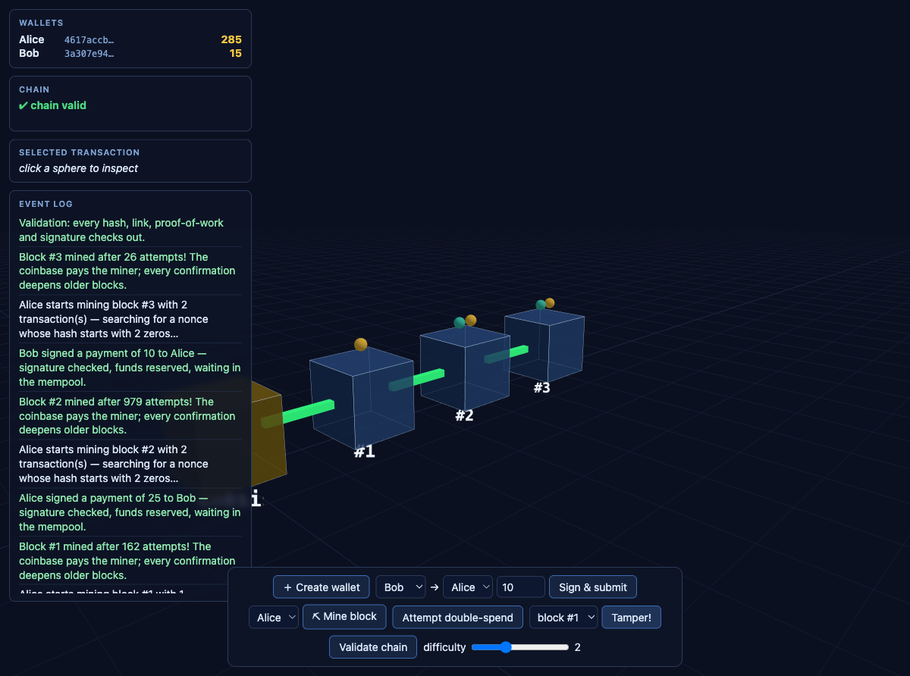
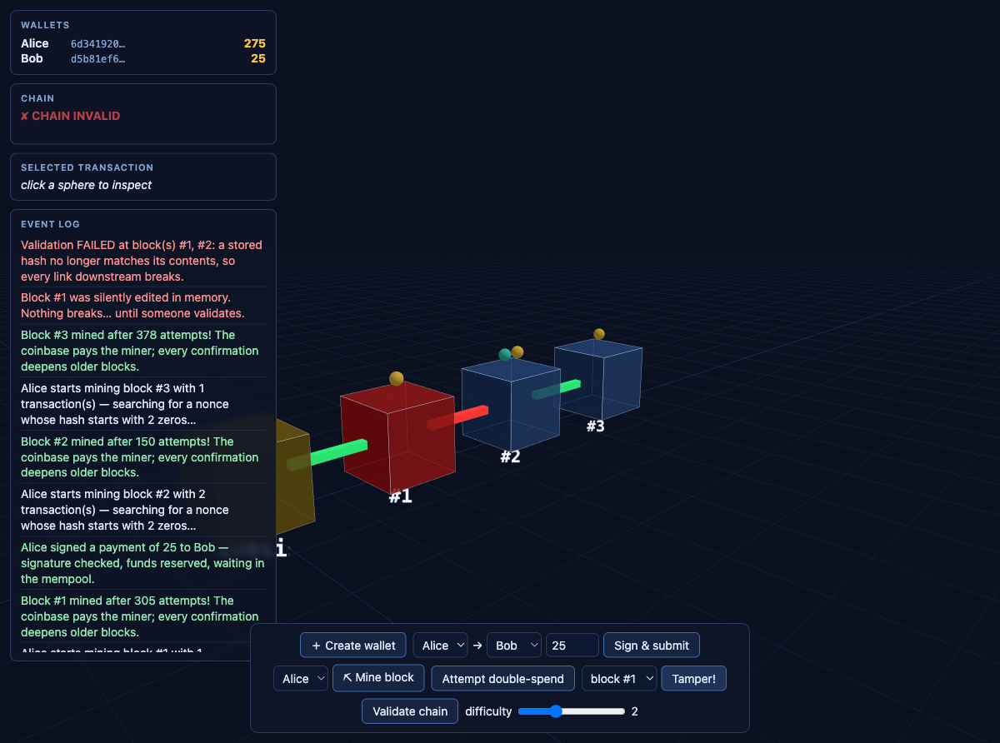

# tschain-visualizer

An **educational blockchain built from scratch in TypeScript**, with a 3D
visualization in the browser (three.js). No backend, no database, no
network — everything runs locally, so every moving part is yours to poke.


*A valid chain: gold genesis block, mined blocks, transaction spheres, green `previousHash` links.*


*After tampering with block #1: the edited block turns red and the link to its child breaks.*

## The concepts (and where they live)

| Concept | Idea | Code |
|---|---|---|
| **Hashing** | A SHA-256 hash is a fingerprint of data: deterministic, and any change produces a completely different hash. Transactions and blocks are identified by their hash, which is what makes tampering detectable. | `src/core/Transaction.ts`, `src/core/Block.ts` |
| **Signatures** | An Ed25519 keypair: the public key *is* the address, the private key is the ability to spend. Signing the transaction hash proves authorization; anyone can verify with only public data. | `src/core/Wallet.ts` |
| **Proof-of-work** | A block only counts if its hash starts with N zeros. Finding such a hash is brute force (expensive); checking it is one hash (cheap). Rewriting history means redoing all that work. | `src/core/Block.ts` (`mine`) |
| **Tamper evidence** | Each block stores its parent's hash, and its own hash covers that pointer. Edit any byte of history and the chain breaks loudly at the edit — and stays broken downstream even if you re-mine. | `src/core/Blockchain.ts` (`isChainValid`) |
| **Derived state** | There is no balances table. Balances and nonces are recomputed by replaying the chain — the history *is* the state, so ledger and state can never disagree. | `src/core/Blockchain.ts` (`getBalance`) |
| **Double-spend prevention** | Two transactions can both be perfectly signed and still spend the same coin. The mempool checks balance (counting already-pending spends) and a dense per-sender nonce sequence before admitting anything. | `src/core/Mempool.ts` |
| **Confirmations** | A transaction buried N blocks deep needs N proof-of-works redone to undo it. Depth = security; that's why exchanges wait for ~6 confirmations. | `src/core/Blockchain.ts` (`getConfirmations`) |

## Running it

```bash
pnpm install        # or npm install

npm test            # 37 unit tests — one file per core concept
npm run demo        # narrated console walkthrough (mining, double-spend, tampering)
npm run dev         # 3D visualizer at http://localhost:5173
npm run build       # type-check + production bundle
```

## Using the visualizer

1. **Create wallet** (twice) — wallets are keypairs; they own nothing yet.
2. **⛏ Mine block** — the coinbase reward mints the first coins. Watch the
   ghost cube pulse while the nonce counter searches.
3. **Sign & submit** — the payment waits in the floating mempool, then
   flies into the next mined block.
4. **Attempt double-spend** — two fully-signed transactions spending the
   same balance; the event log explains why the second falls out of the sky.
5. **Tamper!** — silently edit a past block, then watch validation paint
   the edited cube red and break the link to its child.
6. Click any transaction sphere to see its confirmations grow as you mine
   more blocks. The **difficulty slider** makes each extra zero ~16× the work.

## Architecture

```
src/
  core/          Phase 1 — pure domain logic, zero DOM/three.js imports
    Transaction  deterministic serialization + SHA-256 identity
    Wallet       Ed25519 keypair, sign/verify
    Block        PoW mining (async chunked, UI-friendly)
    Blockchain   tamper-evident linked list, derived state
    Mempool      admission pipeline: signature → balance → nonce
    events       tiny typed EventEmitter (the Model→View seam)
  app/           Phase 2 — MVC
    model/       ChainModel: wraps core, emits typed events
    view/        SceneView, BlockMesh, ChainLinkMesh, MempoolView, Hud
    controller/  Controller: DOM events → model calls, model events → view updates
  demo.ts        narrated console story (npx tsx src/demo.ts)
tests/           vitest, one file per core class
```

The Model never imports three.js or touches the DOM; the View never
computes a blockchain rule. The git history is one commit per step, so
`git log` reads as the build-up of the concepts above.

## Honest limitations (also educational)

- One node, no network: there is no consensus to win, so "longest chain"
  never comes into play — `getConfirmations` explains what *would* happen.
- Flat transaction list per block instead of a Merkle tree.
- Coinbase amounts aren't consensus-checked, and there are no fees.
- Mining runs on the main thread in async chunks (simple, frame-friendly);
  a Web Worker would mine faster but complicate the code.
